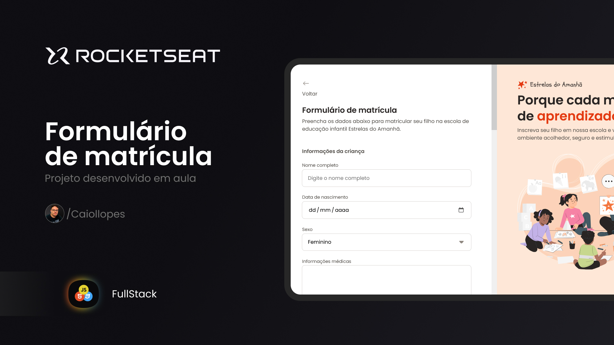

<h1 align="center"> Formulário de matrícula </h1>

 

  

## 💻 Projeto

Formulário de matrícula é um projeto desenvolvido em aula para praticar o que aprendei e desenvolvi.

## 📚 Aprendizado

Neste projeto eu aprendi:

- HTML Forms
- Button
- Input (text, number, email, password, file, range e color)
- Checkbox, Radio e Hidden
- Label

## 🚀 Tecnologias

Esse projeto foi desenvolvido com as seguintes tecnologias:

- HTML e CSS
- Git e Github
- Figma

## 🔖 Web site

Você pode visualizar este projeto 
<a href="https://caiollopes.github.io/formulario-de-matricula-rks/" target="_blank">Clicando aqui!</a>
